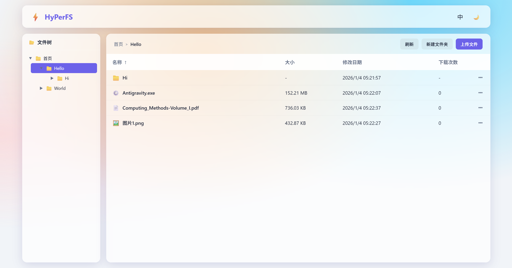
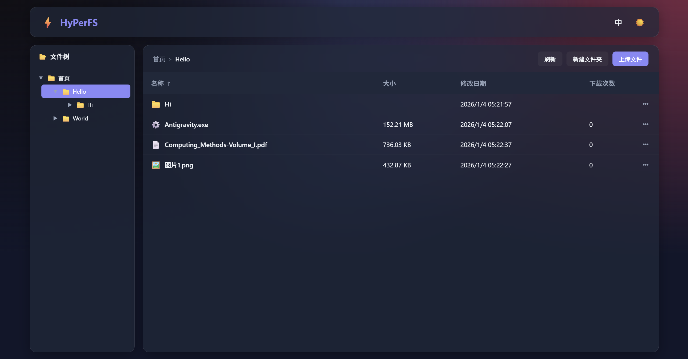

# 高性能网络文件服务器*HyPerFS*——《Java程序设计》结课项目

[TOC]

## 名称由来

这个名字是AI取的。我告诉Gemini我想做一个高性能的网络文件服务器并让他取名，他给的一个选项就是这个。“HyPerFS”是英文单词“High Performance File Server”经过缩写和变形后得到的，同时还能形成“Hyper”一词，我觉得很妙，便采用了。似乎跟某个开源项目撞名了，但我不管了。

## 使用方式

### 环境要求

- JRE 21
- （客户端可选）网页浏览器（如Google Chrome、Firefox）
- （客户端可选）支持WebDAV协议的文件浏览器（如Windows File Explorer、Cyberduck）

### 安装

无需安装。

### 启动

在服务器包所在目录（或根据具体位置修改）执行命令

```bash
java -jar HyPerFS-1.0.0.jar [端口号]
```

其中端口号是可选的。当未填写或不合法时，程序将采用默认端口`80`。

### 访问

以下假设程序运行在本机`14514`端口上（您可以根据具体情况修改，若采用默认端口则可以不输入端口号）。

#### 方式一：网页浏览器

打开网页浏览器，键入URL`http://localhost:14514`即可访问。

#### 方式二：文件浏览器

打开支持WebDAV协议的文件浏览器，在相应位置键入URL`http://localhost:14514/webdav`即可访问。

> [!IMPORTANT]
>
> 如您使用Windows File Explorer，即Windows系统自带的文件浏览器添加该网络位置，可能需要额外配置注册表和防火墙设置。为简便起见，建议采用第三方文件浏览器。经测试，Cyberduck可以完美支持。

### 停止

作为一个服务器项目，本程序不会自动停止。只需向程序发送`SIGINT`停止信号（在Powershell和Linux终端，通常只需按下`Ctrl C`快捷键）即可安全停止，不会有数据丢失风险。

### 清理

服务器会自动清理存放超过30天的日志文件。

项目源码中的`cleanup.ps1`是一个Powershell脚本，执行该脚本可以清理当前目录下服务器产生的日志、数据库、临时文件和存放的文件。

> [!CAUTION]
>
> 该操作会**永久删除服务器保存的文件和记录**！

## 程序开发环境

- 操作系统：Windows 11 Pro 23H2
- 爪哇开发组件：JDK 21.0.4
- 集成开发环境：IntelliJ IDEA 2025.2.5 (Ultimate Edition)
- 编辑器：VS Code 1.107.0、Antigravity 1.13.3
- 版本管理：git version 2.45.2.windows.1

## 项目概览

### 代码行数

截至本文档编写时，使用工具`tokei`统计的结果为
```bash
PS E:\Projects\HyPerFS> tokei
===============================================================================
 Language            Files        Lines         Code     Comments       Blanks
===============================================================================
 Java                   15         3418         2176          824          418
 PowerShell              1           21           18            0            3
 XML                     3          248          224           11           13
-------------------------------------------------------------------------------
 HTML                    1          250          213           21           16
 |- CSS                  1          599          496           19           84
 |- JavaScript           1         1189          931           89          169
 (Total)                           2038         1640          129          269
-------------------------------------------------------------------------------
 Markdown                4          687            0          443          244
 |- BASH                 1           21           21            0            0
 |- Java                 1           35           32            0            3
 (Total)                            743           53          443          247
===============================================================================
 Total                  24         4624         2631         1299          694
===============================================================================
```

### 项目结构

```
HyPerFS
├── src
│   ├── main
│   │   ├── java
│   │   │   └── cn
│   │   │       └── edu
│   │   │           └── bit
│   │   │               └── hyperfs
│   │   │                   ├── db
│   │   │                   │   ├── DataAccessException.java
│   │   │                   │   ├── DatabaseFactory.java
│   │   │                   │   ├── FileMetaDao.java
│   │   │                   │   ├── FileStorageDao.java
│   │   │                   │   └── InsertFileResult.java
│   │   │                   ├── entity
│   │   │                   │   ├── FileMetaEntity.java
│   │   │                   │   └── FileStorageEntity.java
│   │   │                   ├── handler
│   │   │                   │   └── HttpServerHandler.java
│   │   │                   ├── server
│   │   │                   │   └── HyPerFS.java
│   │   │                   └── service
│   │   │                       ├── DatabaseService.java
│   │   │                       ├── FileDownloadResource.java
│   │   │                       ├── FileService.java
│   │   │                       └── FileUploadSession.java
│   │   └── resources
│   │       ├── static
│   │       │   └── index.html
│   │       └── logback.xml
│   └── test
│       └── java
│           └── cn
│               └── edu
│                   └── bit
│                       └── hyperfs
│                           ├── handler
│                           │   └── HttpServerHandlerTest.java
│                           └── PerformanceTest.java
├── cleanup.ps1
├── dependency-reduced-pom.xml
└── pom.xml
```

## 程序需求分析

### 动因描述

我的创造力大抵已经被抹杀了——或者本来就没有。总之，想不到做甚么，就做了金老师提供的这个项目方案，并根据实际情况和我的想法做了一些改动。

它的名字已经很好反映了它的功能——“网络文件服务器”。我希望可以实现在浏览器或者客户端上传、下载、复制、移动、删除文件，并且可以创建文件夹并列出目录。可以理解为一个简单的网盘。

### 竞品分析

这种简单的操作，成熟的方案是很多的，例如各大网盘、JuiceFS、TrueNAS等。

### 功能清单

网页浏览器或WebDAV客户端访问服务器，上传、下载、复制、移动、重命名、删除文件，创建、复制、移动、重命名、删除文件夹。

### 交互设计

采用HTTP 1.1或基于此的WebDAV协议。

对于浏览器访问，服务器会返回一个功能齐全的前端网页：左侧为文件树，右侧为当前目录详细内容，右上角还可以选择中/英文和亮/暗主题风格。





## 程序架构设计与技术实现方案

### 总体技术方案是如何确定的？

在询问Gemini、学习课程的课件后，我决定使用Netty库提供网络服务，使用JDBC操作SQLite数据库。

### 程序中的数据是如何存储和处理的？

我采用文件内容（物理文件）与元数据（文件名和目录结构）分离存储的方式，由此实现内容寻址存储（Content-Addressed Storage, CAS）。我在数据库中维护两张表
```sqlite
CREATE TABLE IF NOT EXISTS file_storage (
    hash TEXT NOT NULL PRIMARY KEY,           -- 十六进制哈希值字符串
    sz INTEGER NOT NULL,                      -- 文件大小
    ref_cnt INTEGER NOT NULL DEFAULT 1,       -- 引用计数
    created_at TEXT DEFAULT CURRENT_TIMESTAMP -- 创建时间
) STRICT;

CREATE TABLE IF NOT EXISTS file_meta (
    id INTEGER PRIMARY KEY,               -- 节点ID
    parent_id INTEGER NOT NULL DEFAULT 0, -- 父文件夹ID（根目录为0）
    name TEXT NOT NULL,                   -- 名称
    is_folder INTEGER NOT NULL,           -- 类型（文件/文件夹）
    hash TEXT,                            -- 十六进制哈希值字符串
    sz INTEGER DEFAULT 0,                 -- 文件大小
    up_tm INTEGER NOT NULL,               -- 节点最后修改时间
    down_cnt INTEGER NOT NULL DEFAULT 0,  -- 下载次数
    UNIQUE (parent_id, name)              -- 同一目录下不可有同名节点
) STRICT;
CREATE INDEX IF NOT EXISTS idx_parent_id
ON file_meta (parent_id);
```

分别存储物理文件信息和文件树结构。物理文件信息包括哈希值、大小和引用计数，额外保存创建时间以便调试和回溯；每个文件或文件夹都是文件树的一个节点，在`file_meta`表上作为一条记录存储ID、父文件夹ID、名称、类型（文件夹还是文件）、哈希值（用于索引物理文件）、大小（列表时无需反复查询`file_storage`）、创建时间和下载次数。

采用这种方式存储，可以分离物理存储和文件树的维护，减少耗时的磁盘I/O，实现文件去重和极高效率的列表、复制、移动、重命名、删除等操作。

### 架构设计

采用经典的分层架构模式：

- 网络接入层：基于Netty处理HTTP/WebDAV协议解析。
  - 采用主从Reactor多线程模型来处理高并发请求。
    - `bossGroup`：包含1个线程，专门接收客户端的TCP连接请求。
    - `workerGroup`：负责处理网络I/O操作。
    - `businessGroup`：配置了32个线程的线程池，专门处理耗时的数据库、磁盘读写等操作，与Netty网络I/O线程分离，防止阻塞网络，从而保证服务器在高负载下正常响应。
  - 协议支持：
    - 标准REST API
    - WebDAV协议
- 业务逻辑层：处理文件系统逻辑。
  - `DatabaseService`：在数据库层面管理文件结构。
  - `FileService`：接受网络层的请求，转换为数据库和磁盘操作。
- 数据存储层：操作SQLite数据库和磁盘I/O。
  - `DatabaseFactory`单例：维护数据库连接池。
  - DAO类：直接操作数据库的CRUD。
  - 实体类：数据库中的记录读取到内存中时用于保存数据。
  - `FileUploadSession`：管理上传状态，接受数据块，计算哈希值并管理临时文件。

## 优缺点

### 优点

#### 高性能

我认为，这个服务器配得上其“高性能”之名。我和AI想方设法，采用了各种手段来尽可能提高运行效率：

- 采用Netty框架，实现**高效网络I/O**。
- 利用**非阻塞线程池**处理高并发连接，额外开一个**业务线程池**处理耗时的阻塞操作。
- **零拷贝**下载：利用Netty特性，**直接将磁盘文件映射到网络套接字**，极大地提高大文件传输效率和避免多余的CPU占用。
- 高效的**虚拟文件操作**：由于CAS和扁平化存储的特性，进行文件复制、移动、删除等操作都仅需分别执行一条数据库命令。
- 开启数据库**WAL模式**，配合**HikariCP连接池**，提高并发写入性能。

性能瓶颈仅在不可避免的哈希值计算和SQLite本身的并发瓶颈。后者是出于简单轻量的目的，由于JDBC的良好兼容性，想要增强到MySQL等更强大的数据库也比较容易。

#### 存储机制优秀

实现了CAS机制和扁平化存储方式，可以节省磁盘空间和提高性能。

#### 功能特性丰富

- 支持**WebDAV协议**：用户可以像操作本地磁盘一样，通过文件管理器直接挂载和管理服务器上的文件。
- **断点续传**与**多线程下载**：支持HTTP`Range`头解析，能够处理对局部内容请求。这使得客户端可以暂停/恢复下载或使用IDM等下载器进行多线程分段下载。
- 网页端支持中英双语、昼夜两主题。

#### 跨平台

采用HTTP协议，有浏览器就能用，网页能自适应浏览器窗口形状和大小。

#### 架构轻量且健壮

- 采用**嵌入式数据库**：使用SQLite配合HikariCP，部署简单，无需安装额外的数据库服务。
- 针对各种异常作出处理，当前版本未观察到任何崩溃情况。
- 通过数据库事务控制保证数据一致性。
- 日志详细，同步输出到控制台和文件。

### 缺点

#### 安全性差

- 没有做用户登录鉴权，任何人都能访问并修改任何文件。这也意味着这个服务器尚不能接入公网，只能内网个人用。
- 没有支持HTTPS协议，数据在传输过程中是明文的，可以被窃听。

#### 扩展性限制

不支持分布式存储，仅限于单机存储。

#### 硬编码

数据库路径、数据目录和临时目录等是硬编码的，没有提供配置文件来外部化配置，部署灵活性差。

## 遇到的技术难点和解决方案

这是本项目开发中**最戏剧性、最令我震惊、最引人深思**的事件。我必须详细叙述。

当我引入Netty时，其最新稳定版本是`4.2.7`，于是我就装上用了；过了几天发现这个版本相关文档少、AI提示差，会有很多`deprecated`等警告，遂决定回退到`4.1`，当时这个小版本最新的是`4.1.129`，于是装上用了。

中间忙了很多别的作业考试甚么的。到了二十几号，我开始大力开发时，发现我的服务器上传一个名为`Computer Systems- A Programmer's Perspective, Global Edition -- Randal E_ Bryant, David R_ O’Hallaron_ Manasa S_, Mohit -- 3, Global Edition, 2015 Anna’s Archive.pdf`会无法解码URL。我感到疑惑，二分文件名后发现，凡是带大写字母`M`就会爆炸。我便越发怀疑人生，遂把26个大写字母都试了一遍，发现**凡是带`M`和`J`就不行，别的都可以**。这使我百思不得其解，“难道我的电脑是Michael Jackson的粉丝吗？”我这样想。

我实在调了半天调不出问题，问AI也找不出，遂直接用调试器找到第一个抛出异常的地方。是在**Netty源码**里面，`io.netty.handler.codec.http`包的`HttpUtil`类。请您猜猜为何`isEncodingSafeStartLineToken`对于凡是含`M`或`J`的字符串都返回`false`：

```java
   public static boolean isEncodingSafeStartLineToken(CharSequence token) {
      int i = 0;
      int lenBytes = token.length();
      int modulo = lenBytes % 4;

      long ch;
      for(int lenInts = modulo == 0 ? lenBytes : lenBytes - modulo; i < lenInts; i += 4) {
         ch = 1L << token.charAt(i) | 1L << token.charAt(i + 1) | 1L << token.charAt(i + 2) | 1L << token.charAt(i + 3);
         if ((ch & 4294976512L) != 0L) {
            return false;
         }
      }

      while(i < lenBytes) {
         ch = 1L << token.charAt(i);
         if ((ch & 4294976512L) != 0L) {
            return false;
         }
         ++i;
      }

      return true;
   }
```

**答案就在那个神秘的magic number和那一堆自以为是的位运算中。**

根据其二进制位，相当于有且仅有第32位、第13位、第10位是`1`，其余都是`0`。这几个位置正好对应ASCII码中的`'\n','\r',' '`。如果一个字符的ASCII码对应到这几个位置，函数就会返回`false`，即认为是有非法的URI字符。然而由于是对`64`取模，普通字符`` ` ``（$96\bmod64=32$）、`M`（$77\bmod64=13$）和`J`（$74\bmod64=10$）也会被误杀。

爽。原来是库有bug。浪费了我两三个小时。**使用如此广泛的库，居然会发布有如此严重的问题的代码。**

再到Maven上面一看，这个版本12月12日发布，仅三天后就发布了现在的最新版本。更新一下，果然没问题了。这就是Netty库的issue "Fix HTTP startline validation (#16022) #16024"。那现在的新版本采用怎样的实现呢？

```java
      for(int i = 0; i < lenBytes; ++i) {
         char ch = token.charAt(i);
         if (ch <= ' ') {
            switch (ch) {
               case '\n':
               case '\r':
               case ' ':
                  return false;
            }
         }
      }
      return true;
```

没错，删掉了自作聪明的位运算，回归传统手艺`switch case`。

##### 几点启发和警示

- **新版本不一定就好**，没事别用新东西，先让大家公测一段时间。
- 如果我的代码实在找不出bug，那说不定bug真不是我写的。**怀疑一下第三方库、标准库、编译器、电脑和宇宙射线**。
- **现阶段的**AI还不足以替代人类。在编程方面，AI也许可以解决大部分问题，但剩下的还得让人来。

## AI技术及工具应用情况

### 情况介绍

大量使用Gemini 3 Pro和Claude Opus 4.5模型。

一开始我还是保守派，仅使用Gemini来询问方案和Copilot进行少量代码补全。后面意识到由于最初设计不佳，不得不大范围重构，而剩余时间又不多时，决定使用coding agent。我先是写了详细的方案，然后再给agent生成代码。不久我就发现，我的方案实际上在限制它的手脚，它的设计比我好，遂开始放飞自我vibe coding，以极高的速度、极好的效果完成了其余的功能。不过为了避免删库惨案（项目有git问题不大，我怕给我电脑别的地方整坏了），所有命令均由我审核才能运行。

### 感想

> GPT-5在ICPC 2025 World Final中以**12题all kill**的成绩击败了所有人类选手（最强的人类队伍也仅解出11题），算法竞赛成为又一个AI击败人类的领域。

我不得不承认，现阶段的AI在写代码方面远远超过绝大部分人类，包括我在内。有人说，AI不擅长创新，可我看绝大部分人也都是重复造轮子。

正如前面所说，**就目前的情况看，AI仍然不能脱离人类而存在**，仅能作为程序员的好帮手，程序员仍有其广泛存在的必要性。AI可以节省重复造轮子的时间，也可以快速做出好看有高级感的前端，使人类能够将更多注意力投入到整体设计问题的关键部分。不过我认为，**人工智能彻底替代程序员的日子并不遥远**，现今的AI领域前景广阔且呈上升态势，仿佛百余年前的物理领域一般；只不过AI的理论尚不完备，可解释性亟待改善，但这也正是前景所在。

程序员失业的危机是与日俱增的，别的职业则更糟糕。也许在不久的未来，人类将在一切领域被AI超越。也许通用人工智能终将出现，届时一切人类都将失去用武之地；那将是生产力的极大爆发，也将是人类的极大危机；我无法预料到时候会是怎样一幅光景，我也不知道人类的前途在那里。常有人说，AI永远模仿不了人脑，甚么感情啊，甚么意识啊，玄玄乎乎的。可我看，“**‘他’只是一堆代码，而我也不过是几串细胞**”[^1]，“他”与“我”，并无本质差别。

## 开发日志

[在GitHub上可以看到我的commit记录。](https://github.com/Joyce-Peng-GitHub/HyPerFS/commits/main/)

### 2025/11/27

和朋友讨论了一下构想，向双子座咨询了可行性。

### 2025/12/08

前几天一直在写作业和搞CACC的事情，今天终于可以开始搞了。

本来预备在WSL下写，这个IDEA搞半天没搞好，登不上GitHub，不得不转回Windows。

向双子座咨询了相关的技术路线，列出功能树，制定规划。

初始化项目，学习Maven用法，配置环境。

### 2025/12/09

成功用Netty写了一个简单的HTTP服务端，可以对浏览器的请求作出应答。尚未实现实际的功能，只是简单地返回收到的请求。

### 2025/12/10

导入SQLite依赖。

设计数据库结构。

编写保存数据库信息的实体类，之后读写数据库的结果就保存到这些类里面。

### 2025/12/17

部分重构，增加代码复用。

实现了文件保存逻辑。还没有加数据库操作。

### 2025/12/18

引入Hikari依赖，用于维护连接池。

实现数据库的创建。实现了`file_storage`表的相关操作。

### 2025/12/22

实现了`file_meta`的部分逻辑。

### 2025/12/24

实现列表功能。

实现创建文件夹功能。

有个问题：上传文件时，如果在同一个目录下上传相同名称的文件，此时`file_storage`中`ref_cnt`会自增，但插入`file_meta`表时会因为违反`UNIQUE CONSTRAINT`而抛出`SQLException`，这会导致`ref_cnt`与实际的引用数不匹配。

重名警告应该交给前端处理。服务器应当直接当作替换来处理。

另外目前`/list`回传的JSON还很朴素，可以被注入攻击，也许会祸害前端。（真能吗？）

还有`mv`、`cp`要做。

### 2025/12/25

为了解决昨天发现的这个问题，我应当将数据库操作再抽象出一层。DAO类只管读写，引用计数甚么的逻辑应该由服务层来处理。然后再把文件服务抽象出一层。

这就是一开始没设计好的下场。但是确实之前没有经验。做大作业的意义就在于此罢。

重新设计一下。

### 2025/12/28

重新设计。

### 2025/12/31

重新设计。

### 2026/01/01

终于设计好了。用AI根据计划重构代码。看起来它做得很不错，比我强太多。

Vibe coding真牛逼，AI真好用。我要失业了。

### 2026/01/02

Vibe coding添加对文件夹移动、重命名、复制的支持。禁止涉及同名文件夹覆写的复制、移动、重命名，毕竟连百度网盘这种大型商业软件（虽然是一坨屎）都不支持这种复杂的合并操作。

目前有1400行左右，可以再加点功能。考虑做个注册登录鉴权。另外应当做一些自动化测试，此前都是我手动测试功能，没办法模拟多用户同时操作的并发情况。

实现了断点续传。略微优化。

### 2026/01/03

让AI支持WebDAV协议。但我发现凡是文件名带J或M的文件上传都会报解码失败，说是含有非法字符，令我怀疑人生。我直接点到抛出异常的地方阅读Netty源码，才发现是他这个库有严重的bug，自以为是地用位运算技巧判特殊字符，但是对M和J都会误判。更新Netty版本后解决，我看见新版本回退为了普通的`switch`。如此这么严重的bug怎么能发布的？我真服了，浪费我差不多三个小时，害人不浅。

支持了WebDAV协议。

优化性能。优化前端页面。

引用计数为0时删除物理文件。

优化前端页面。本来想让AI做个像Windows File Explorer那样的，调教半天没有搞出来，遂放弃。

### 2026/01/04

添加用于打包的配置。

增加对选择端口的支持。

增加安全关闭的支持。

优化前端页面，增加文件树。

编写设计文档。

## 个人小结

我现在的确没太多创意，想了半天也不知道做甚么，只好决定做群里发的项目思路之一，只自己稍微改改，加点WebDAV支持甚么的。

学校的安排太不合理！大一下学期，我那里是计算机专业啊？简直是物理政治双学位！上交的同学学了一年甚么都会了，活脱脱一个全栈工程师，我们在干甚么？在学物理、化学！在学思政、历史！！在做物理实验、手写代码！！！为了那点分数，我不得不卷学业，作业又多，搞算法竞赛都得靠挤时间，更不要说花大把时间钻研开发技术了。计算机学院现在也不知道在搞甚么名堂，连报销XCPC的钱都出不起。

我以前学了C/C++，业余搞过算法竞赛，但没有搞出成绩（不然也不会在北理）。正如汉语是我的母语，但不代表我语文好一样；C/C++作为编程母语塑造了我的思维方式，但不代表我精通C/C++。但这于我学习爪哇、蟒蛇等其他语言是有利的，因为我很清楚每个操作背后的大致原理和时空代价，可以想尽办法优化。常有人说爪哇不用关心指针，学起来更容易；可我，看实际上爪哇到处都是指针，几乎甚么东西都往堆上面放。对比于C++，**爪哇的包管理和生态确实太爽了，各种工具也太方便，确实是很适合快速进行工程开发**；可它语言的限制也确实比较多，例如删掉了极好的析构函数、运算符重载等，也不如C++自由。油管上有人连喷C++两小时，我全都看完了，我觉得基本上都很对，C++本身就有缺陷；我希望尽早出个秦始皇，把C++各种生态大一统，狠狠改进一下，或是出个比较现代化的、取其精华去其糟粕的语言（现在来看，生锈的希望比较大）替代掉C++的生态位，那就太好了。

常看到有人纠结现在学甚么语言最好，但说实在，编程语言本身并不重要，特别是学了C/C++知道一切的原理后，甚么语言都能互通，学甚么语言都快，关键还是思想要跟上。思想是内容，语言是形式，内容对形式具有决定作用。要学好编程，关键还在**算法能力和工程设计思维**。无论是哪一个，我觉得现在的我都很欠缺，需要狠狠加练。

做项目，**预先设计好是极其重要的**，必须先想清楚再上手写代码。设计清楚，不仅编码逻辑清晰，修改和扩展起来也很快；如果一开始设计不好，后面再想重构可就困难了。我就是吃了这个大亏。一开始缺少经验，没有现在这么清楚的分层架构，后面发现代码改不动了，逻辑太混乱了，不得不重构。积累系统设计的经验，我觉得是我搞这个结课项目最大的收获。我的确学到了很多。

关于AI的部分，前面已经讲过了，便不再复述。

金老师的确是很好的老师，狠狠好评。下个学期继续上金老师的课，嘿嘿。要是计院多些这样的好老师就好了。

## 参考文献

[^1]: [【"她"只是一堆代码，而我也不过是几串细胞】 ](https://www.bilibili.com/video/BV1YymFBuEim/)

## 特别感谢

- 感谢[金旭亮老师](https://www.weibo.com/u/1461522430)的指导。
- 感谢我的若干挚友的支持与启发，特别感谢Ritel多年来借我使用谷歌账号，使我得以尽情使用AI。
